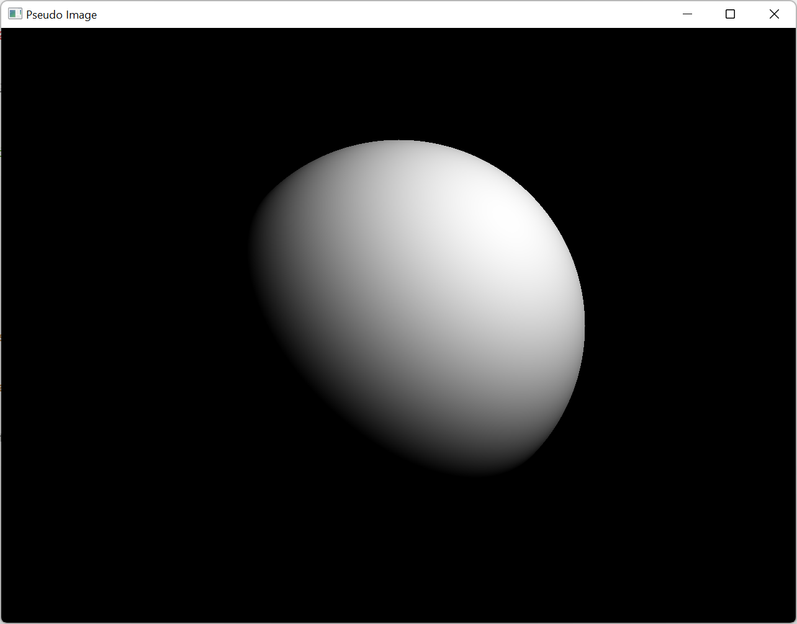

# Instructions

The makefile is built to be used from Ubuntu WSL in Windows.

## Assumptions

- Bash
- x86_64 architecture
- OpenGL 4.5 minimum
- C++17

# Dependencies

## Libraries

- GLFW
- GL3W

## Tools

- build-essential
- mingw-w64
- python3
- unzip
